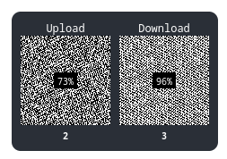

# Fetch Visualizer

Do you miss the days when you could hear your hard drive working whenever something was loading?
Now you can get that back, but with a modern update. It's annoying when websites make noise, why
not use a visual indicator!

Fetch Visualizer is a [Svelte](https://svelte.dev/docs) component that wraps your
`fetch` calls, and all request and response data must first be shown on a canvas as a grid
of pixels, each being either white or black to represent the binary representation of the data. Yes,
finally the world of programming didn't have to stop at tying racing game physics to framerate, now
we can tie your internet speed to your framerate too!

Wrap your app in a `<FetchVisualizer> <slot /> </FetchVisualizer>` then use the fetch you get from
context at `const fetch = getContext('fetch')` inside a child component.

